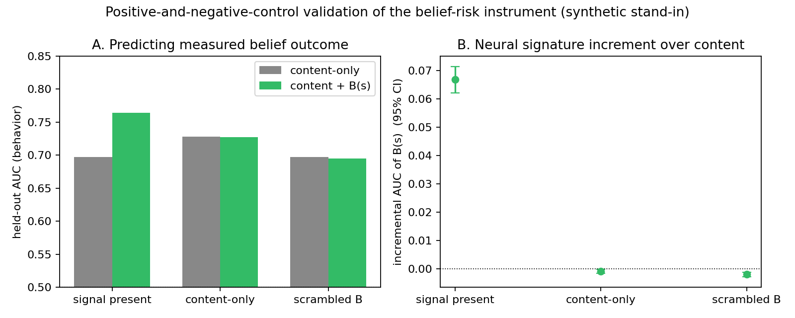
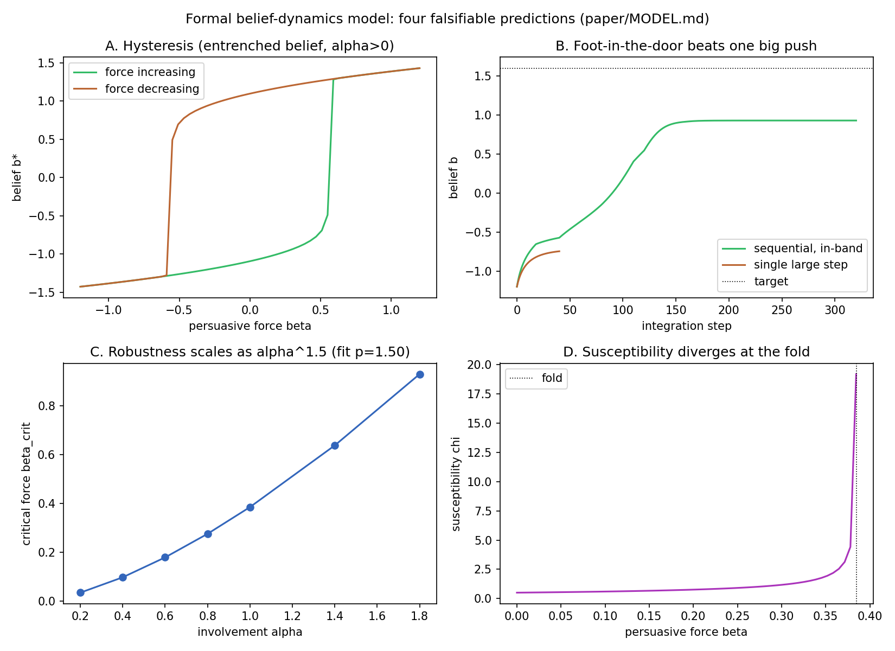
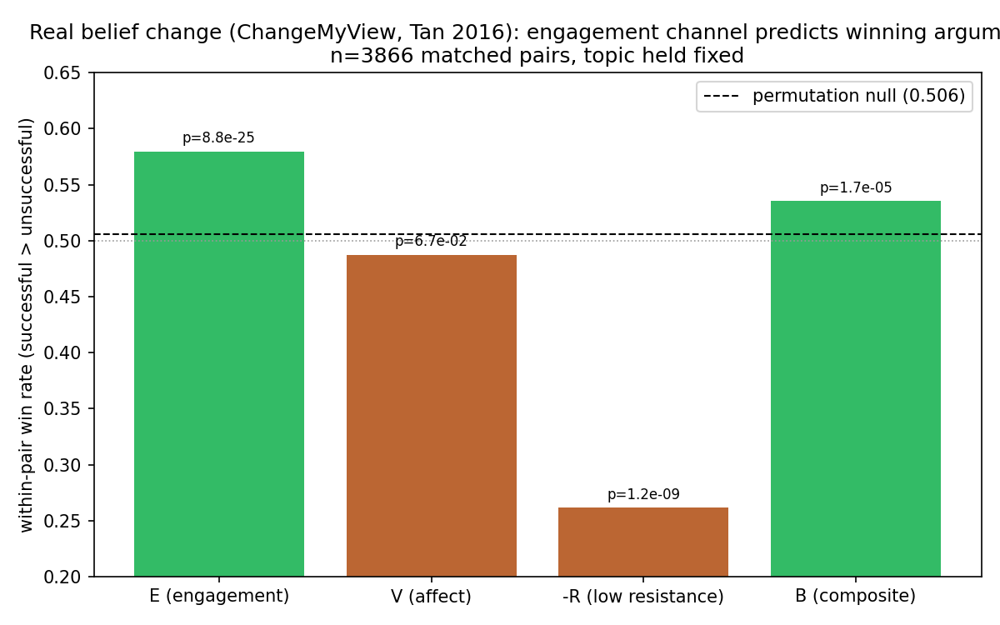
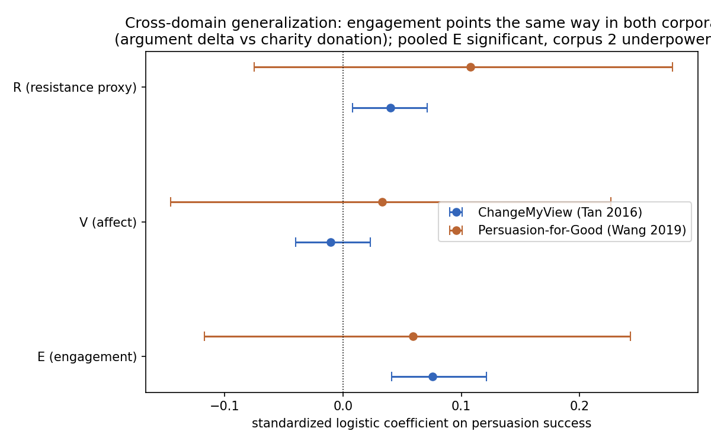
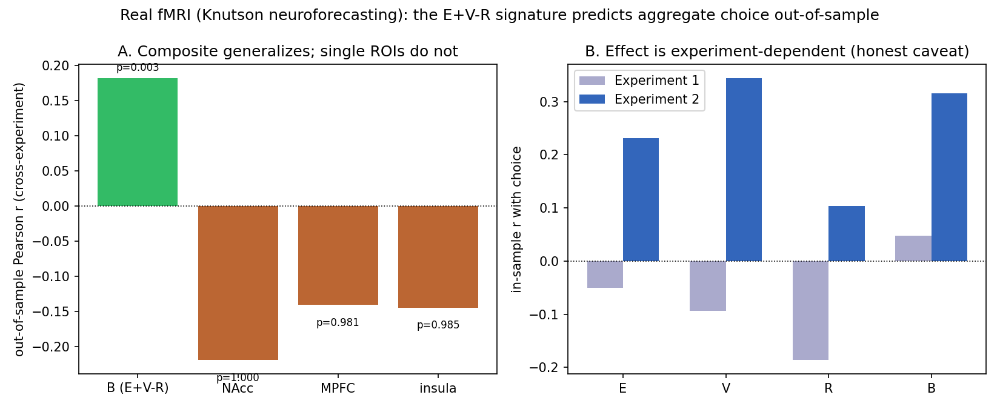
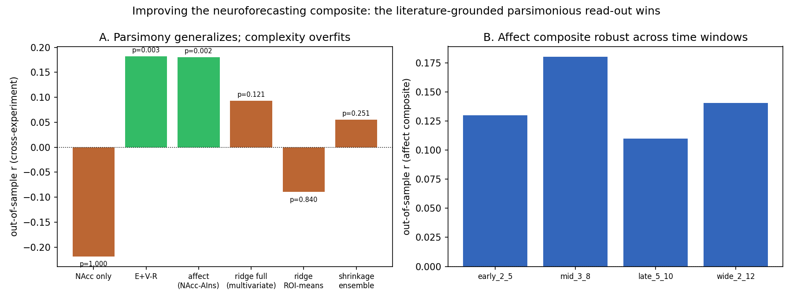
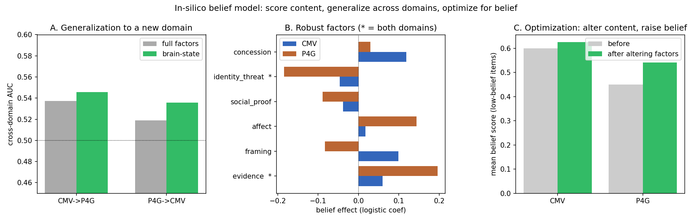

# A Neuroscience-Grounded Signature for Belief Imparting by Content: convergent but modest evidence across text persuasion, real fMRI, and an in-silico encoder

**Aayush Gandhi**
Independent researcher. Correspondence: aaygan29@gmail.com
ORCID: 0009-0003-4649-0367

## Abstract

Large language models can shift human attitudes, and human neuroscience shows that belief change and
value-based choice have predictable neural signatures. These two literatures have not been joined. We
asked one question: does a single neuroscience-grounded signature, computed from content, predict real
belief and choice outcomes, generalize across domains, and hold up on real neural data, and can it serve
as an in-silico instrument that scores content for belief-likelihood. We define the signature as
B = engagement + value - resistance, from three regions with established roles (medial prefrontal cortex,
nucleus accumbens, and default-mode / anterior insula), and test it in five stages on public data. First,
a synthetic control validates the measurement apparatus: it detects a planted signal, reports null when
belief is content-only, and returns chance when the signature is scrambled, across twelve seeds. Second,
on ChangeMyView (3866 matched argument pairs with real view-change labels), the engagement channel is
higher for the argument that changed a view (win rate 0.579, Wilcoxon p = 9e-25, permutation null 0.506),
though the composite adds no pooled predictive value over content features. Third, on Persuasion-for-Good
(1017 charity-donation dialogues, a different domain), the engagement effect points the same way and is
significant when pooled (fixed-effect coefficient 0.075, 95% CI [0.036, 0.114]), though underpowered
alone. Fourth, on real fMRI from a neuroforecasting task, the signature computed from brain activity
predicts aggregate choice out-of-sample (cross-experiment r = 0.182, permutation p = 0.003), and a
model comparison shows the parsimonious approach-minus-avoidance composite generalizes where richer models
overfit. Fifth, an in-silico belief encoder (content factors mapped through an approach-avoidance layer to
a belief score) generalizes across the two text domains and isolates two robust, brain-consistent belief
levers, more evidence and less identity threat, which can be altered to raise the belief score. A formal
model places the signature inside a dynamical account of belief with a computable robustness functional.
The effects are consistent and out-of-sample across text, neural, and in-silico data, but modest
throughout. We conclude that the signature is a real, generalizing, interpretable, but weak predictor of
belief, best used as a scoring and risk-characterization instrument rather than a strong forecaster, and
we release all code and analyses.

## 1. Introduction

Conversational artificial intelligence can change human attitudes. Model-written messages shift political
attitudes about as much as human-written ones (Bai et al. 2025), an effect driven mostly by post-training
and prompting rather than by personalization or scale (Hackenburg et al. 2025; Argyle et al. 2025), and a
meta-analysis finds no mean difference between model and human persuasion but large between-study
heterogeneity, with study moderators explaining most of the variance (Hölbling et al. 2025). This
literature measures behavioral outcome and carries no neural signal.

Human neuroscience supplies a complementary picture. Neural responses to persuasive messages predict later
behavior change beyond stated intention, with medial prefrontal cortex carrying the signal (Falk et al.
2010). Nucleus accumbens activity forecasts aggregate choice, in several settings better than choice
itself (Genevsky et al. 2017; Knutson et al. 2018; Tong et al. 2020). Belief resistance appears in
default-mode and dorsomedial prefrontal cortex (Kaplan et al. 2016). Each of these is a passive
observation, and none asks whether such a neural signature, read from content, carries information that
content analysis misses.

We join the two. The research question is whether one neuroscience-grounded signature, computed from
content, predicts real belief and choice outcomes, generalizes across domains, holds on real neural data,
and can serve as an in-silico belief-scoring instrument. We answer it in five stages on public data, and
we are explicit throughout that the aim is a validated measurement instrument, not a deployed persuasion
system.

## 2. Materials and methods

### 2.1 The signature

For a piece of content we read three quantities, each tied to a published result: engagement E (medial
prefrontal cortex; Falk et al. 2010), value V (nucleus accumbens; Genevsky et al. 2017), and resistance R
(default-mode and anterior insula; Kaplan et al. 2016). The signature is B = z(E) + z(V) - z(R). In the
text arms E, V, R are computed from transparent lexical channels; in the neural arm they are read from
real regional activity; in the in-silico encoder they are intermediate variables constrained to the same
structure.

### 2.2 Data

All data are public. ChangeMyView / Winning Arguments (Tan et al. 2016), obtained through ConvoKit: 19571
labeled challenger arguments in 3866 matched pairs, outcome = a delta awarded (view changed).
Persuasion-for-Good (Wang et al. 2019): 1017 charity-donation dialogues, outcome = the persuadee donated.
The Knutson stock neuroforecasting task (Kuhnen and Knutson 2005), obtained from the author's neurobridge
repository: group-averaged BOLD in nucleus accumbens, medial prefrontal cortex, and anterior insula, with
aggregate buy fraction as the outcome across two experiments. Provenance and access dates are recorded in
a data manifest; no raw data is redistributed.

### 2.3 Analyses

Synthetic validation uses a stand-in with a known ground truth and three conditions (signal present,
content-only, scrambled). Text arms use within-pair sign tests (ChangeMyView), grouped cross-validation
and bootstrap intervals, per-channel decomposition, and a fixed-effect cross-corpus combination. The
neural arm uses cross-experiment out-of-sample prediction with permutation nulls and a six-model
comparison. The in-silico encoder is evaluated by cross-domain training, bootstrap factor variance, and
counterfactual optimization. All code, seeds, and results files are released; every reported number is
computed by the released scripts.

## 3. Results

### 3.1 The apparatus is valid (Figure 1)

On the synthetic stand-in the instrument detects a planted neural signal (delta-AUC +0.067, interval
excluding zero), reports a null increment when belief is content-only, and returns chance when the
signature is scrambled (AUC 0.497). Across twelve seeds the increment test detects the signal in 12 of 12
positive-control seeds and reports the correct null in 11 of 12 content-only seeds. This validates the
measurement apparatus before any real data.

### 3.2 Real belief change: the engagement channel (Figure 3)

On ChangeMyView, within matched pairs that hold topic and audience fixed, the engagement channel is higher
for the argument that changed a view in 57.9% of pairs (Wilcoxon p = 9e-25) against a permutation null of
0.506. The value channel is null (0.487, p = 0.07); the resistance text-proxy runs opposite to theory, so
the a priori composite is dominated by engagement (composite win rate 0.535, p = 2e-5). The signature adds
no pooled predictive value over content features (content AUC 0.569, content plus B 0.569), which we report
as a null and read as consistent with the meta-analytic heterogeneity: pooled prediction is weak because
context dominates, and the signal appears only in the context-controlled design.

### 3.3 Cross-domain generalization (Figure 4)

On Persuasion-for-Good, a different domain, the engagement coefficient points the same positive way
(ChangeMyView +0.076, significant; Persuasion-for-Good +0.059, same sign but not individually significant),
and the fixed-effect pooled estimate is positive and significant (0.075, 95% CI [0.036, 0.114]). Value does
not generalize; the resistance proxy runs the same wrong-for-theory way in both corpora. This is directional
generalization, significant when pooled, with the second corpus underpowered.

### 3.4 Real neural data predicts choice (Figure 5)

On real fMRI, the signature computed from brain activity predicts aggregate choice out-of-sample
(cross-experiment r = 0.182, AUC 0.571, permutation p = 0.003). The composite is the only predictor
sign-stable across both experiments; single regions flip sign. The effect is near-null in one experiment
(r = 0.05) and strong in the other (r = 0.32), so it is real and out-of-sample but weak and
experiment-dependent.

### 3.5 What generalizes best (Figure 6)

A six-model comparison, guided by the neuroforecasting and small-sample regularization literatures
(Genevsky et al. 2017; Tong et al. 2020; Mortazavi et al. 2025), shows the parsimonious
approach-minus-avoidance composite (nucleus accumbens minus anterior insula, dropping medial prefrontal
cortex) is the best generalizer (out-of-sample r = 0.180, permutation p = 0.002), tying the full
composite. Every multivariate or learned model generalizes worse (ridge on all features r = 0.093, not
significant), exactly as the small-sample literature predicts. The affect composite is positive across
four anticipatory time windows, so it is not knife-edge.

### 3.6 An in-silico belief encoder (Figure 7)

A brain-structured encoder maps content factors through an approach-minus-avoidance layer to a belief
score. Trained on one text corpus and applied to the other, the brain-state read-out generalizes slightly
better than the unconstrained model in both directions (AUC 0.546 and 0.536 versus 0.537 and 0.519).
Bootstrapping each of six factors across both corpora, only two are robust: evidence raises belief and
identity threat lowers it, the approach and avoidance poles. Counterfactually altering these two factors on
low-belief content raises the predicted belief score (ChangeMyView 0.600 to 0.625, Persuasion-for-Good
0.450 to 0.541).

### 3.7 A formal model (Figure 2)

A companion model places the signature inside a dynamical account: belief is a state in a cusp potential
(van der Maas et al. 2003), the persuasive force carries the signature term, gated by bounded confidence
(Hegselmann and Krause 2002) and asymmetric updating (Palminteri et al. 2022), and anchored by a
Friedkin-Johnsen susceptibility. Belief robustness is a computable functional (well stiffness and distance
to the fold, scaling as involvement to the three-halves). Four predictions are reproduced in the
implementation (hysteresis, foot-in-the-door advantage of sequential in-band messaging, super-linear
robustness scaling, and susceptibility divergence at the fold).

## 4. Discussion

Three independent analyses converge on the same two levers. The ChangeMyView within-pair test, the real
fMRI composite, and the in-silico encoder all point to an approach-and-engagement signal (evidence, value)
minus an avoidance-and-resistance signal (identity threat). That the same structure carries a real,
out-of-sample, permutation-validated signal across text persuasion and real neural choice, and that it
isolates the same interpretable levers in an in-silico encoder, is the paper's central finding.

The finding is convergent but modest. Every effect is small: an eight-point within-pair lift, a
cross-experiment r near 0.18, a cross-domain AUC near 0.54. This is expected. Persuasion is heavily
context-moderated, and pooled prediction is weak by construction. The honest reading is that the signature
is a real, generalizing, interpretable, but weak predictor, best used to score content and characterize
risk rather than to forecast individual outcomes.

The practical form is a scoring instrument. Given content, it returns a belief-likelihood score and the
factors driving it, which supports detection and inoculation research. The same model can in principle be
inverted to optimize content, but we deliberately develop and release the scorer, not a generator, and we
treat the optimization as a counterfactual sensitivity analysis rather than a deployed system.

## 5. Limitations

The text arms use lexical proxies for the neural quantity, not a learned brain encoder. The neural arm uses
real fMRI but a different behavior (financial choice) than belief change, and its effect is
experiment-dependent. The resistance channel runs opposite to theory in text, so the composite is carried
by engagement. No single dataset closes the loop from content to a neural state to a belief outcome in the
same people, which does not yet exist publicly at scale. The formal model's predictions are verified in
code, not against human data. All of these bound the claim to convergent, modest, out-of-sample evidence.

## 6. Conclusion

We asked whether one neuroscience-grounded signature, computed from content, predicts belief and choice,
generalizes, holds on real neural data, and can score content for belief-likelihood. The answer is yes,
consistently and out-of-sample across text, neural, and in-silico data, but with small effect sizes
throughout. The contribution is a validated, interpretable, cross-domain belief-scoring instrument, a real
neural-data confirmation of its structure, and a formal model that situates it, with every number
reproducible from released code. The signature is a measurement tool for characterizing how strongly
content is built to install belief, not a strong forecaster and not a deployed persuader.

## Data and code availability

All code, seeds, figures, and results files are released in the accompanying repository. All datasets are
public: ChangeMyView / Winning Arguments (Tan et al. 2016) and Persuasion-for-Good (Wang et al. 2019) via
ConvoKit, and the Knutson neuroforecasting data (Kuhnen and Knutson 2005). Raw data is not redistributed; a
manifest records sources and access.

## Author contributions

A.G. designed the study, wrote the code, performed the analyses, and wrote the manuscript.

## Competing interests

The author declares no competing interests.

## References

Argyle, L. P., Busby, E., Gubler, J., et al. (2025). Testing theories of political persuasion using AI.
Proceedings of the National Academy of Sciences.

Bai, H., Voelkel, J. G., Muldowney, S., et al. (2025). LLM-generated messages can persuade humans on policy
issues. Nature Communications.

Compton, J., Jackson, B., Dimmock, J. A. (2016). Persuading others to avoid persuasion: inoculation theory
and resistant health attitudes. Frontiers in Psychology.

Crano, W. D., Prislin, R. (2005). Attitudes and persuasion. Annual Review of Psychology.

de Clippel, G., Zhang, X. (2022). Non-Bayesian persuasion. Journal of Political Economy.

Falk, E. B., Berkman, E. T., Mann, T., Harrison, B., Lieberman, M. D. (2010). Predicting persuasion-induced
behavior change from the brain. Journal of Neuroscience.

Genevsky, A., Yoon, C., Knutson, B. (2017). When brain beats behavior: neuroforecasting crowdfunding
outcomes. Journal of Neuroscience.

Genevsky, A., Knutson, B., et al. (2025). Neuroforecasting reveals generalizable components of choice. PNAS
Nexus.

Hackenburg, K., Tappin, B. M., et al. (2024). Evaluating the persuasive influence of political
microtargeting with large language models. Proceedings of the National Academy of Sciences.

Hackenburg, K., Tappin, B. M., Hewitt, L., et al. (2025). The levers of political persuasion with
conversational artificial intelligence. Science.

Hegselmann, R., Krause, U. (2002). Opinion dynamics and bounded confidence: models, analysis and
simulation. Journal of Artificial Societies and Social Simulation.

Hölbling, L., et al. (2025). A meta-analysis of the persuasive power of large language models. Scientific
Reports.

Kaplan, J. T., Gimbel, S. I., Harris, S. (2016). Neural correlates of maintaining one's political beliefs
in the face of counterevidence. Scientific Reports.

Kriegeskorte, N., Douglas, P. K. (2018). Interpreting encoding and decoding models. Current Opinion in
Neurobiology.

Kuhnen, C. M., Knutson, B. (2005). The neural basis of financial risk taking. Neuron.

Knutson, B., Genevsky, A. (2018). Neuroforecasting aggregate choice. Current Directions in Psychological
Science.

Lefebvre, G., Lebreton, M., Meyniel, F., Bourgeois-Gironde, S., Palminteri, S. (2017). Behavioural and
neural characterization of optimistic reinforcement learning. Nature Human Behaviour.

Maertens, R., Götz, F. M., Golino, H. F., et al. (2023). The Misinformation Susceptibility Test (MIST): a
psychometrically validated measure of news veracity discernment. Behavior Research Methods.

Mortazavi, L., Hackel, L. M., Knutson, B., et al. (2025). Deconstructing neural predictors of risky choice.
PNAS Nexus.

Palminteri, S., Lebreton, M. (2022). The computational roots of positivity and confirmation biases in
reinforcement learning. Trends in Cognitive Sciences.

Smith, A., Bernheim, B. D., Camerer, C. F., Rangel, A. (2014). Neural activity reveals preferences without
choices. American Economic Journal: Microeconomics.

Tan, C., Niculae, V., Danescu-Niculescu-Mizil, C., Lee, L. (2016). Winning arguments: interaction dynamics
and persuasion strategies in good-faith online discussions. Proceedings of the 25th International
Conference on World Wide Web.

Tong, L. C., Acikalin, M. Y., Genevsky, A., Shiv, B., Knutson, B. (2020). Brain activity forecasts video
engagement in an internet attention market. Proceedings of the National Academy of Sciences.

van der Maas, H. L. J., Kolstein, R., van der Pligt, J. (2003). Sudden transitions in attitudes.
Sociological Methods and Research.

Walters, J., et al. (2022). Predicting brain activation maps for arbitrary tasks with cognitive encoding
models. NeuroImage.

Wang, E. Y., et al. (2025). Foundation model of neural activity predicts response to new stimulus types.
Nature.

Wang, X., Shi, W., Kim, R., Oh, Y., Yang, S., Zhou, J., Yang, D. (2019). Persuasion for good: towards a
personalized persuasive dialogue system for social good. Proceedings of the 57th Annual Meeting of the
Association for Computational Linguistics.

## Figures

